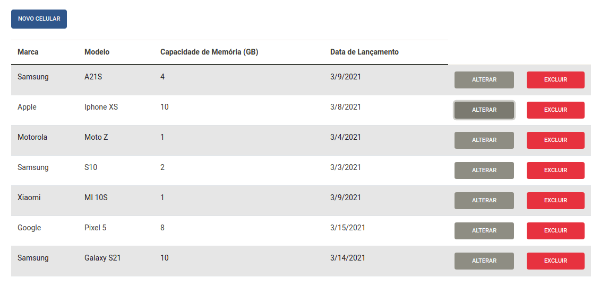
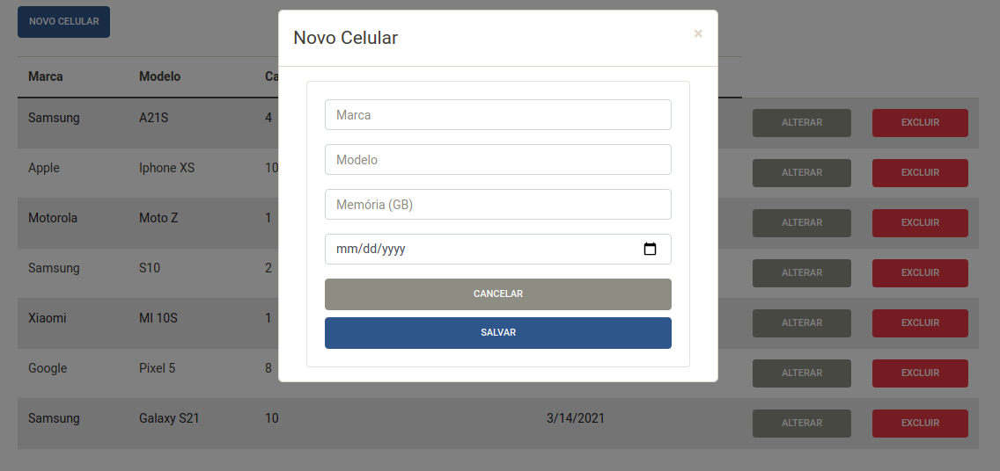

# React, Python Flask & MongoDB CRUD app




### Install Back-End Requirements
```sh
$ cd backend
$ source venv/bin/activate
$ pip install -r requirements.txt
```
### Install Front-End Requirements
```sh
$ cd frontend
$ npm install
```
### Download and Install MongoDB
```sh
https://www.mongodb.com/try/download/community
```
### Run MongoDB
```sh
$ mongo
```
### Run Back-End
```sh
$ cd backend
$ source venv/bin/activate
$ python src/app.py
```
### Run Front-End
```sh
$ cd frontend
$ yarn start
```
